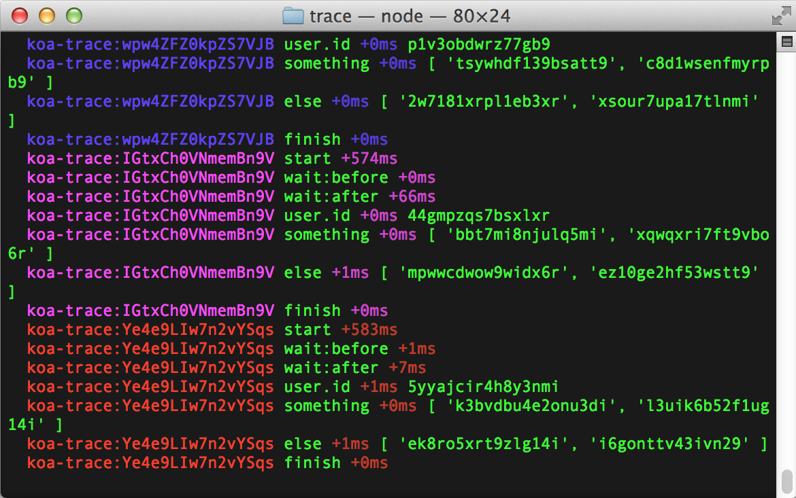

# Koa Trace

A generic tracing module.
Use `.trace()` calls in your middleware
and send all the data to your favorite tracer or stats aggregator
like jstrace, dtrace, ktap, statds, etc.
[debug](http://github.com/visionmedia/debug) also supported!

```js
app.use(function* (next) {
  // give each request some sort of ID
  this.id = crypto.randomBytes(12)

  // log events with optional arguments
  this.trace('start')
  yield* next
  this.trace('finish')
})
```

Enable [debug](http://github.com/visionmedia/debug) usage:

```js
app.debug()
```

Now run your app with `DEBUG=koa-trace:*` and watch the events unfold:



You can see the debug statements grouped by request ID.
Then the event is shown, the time difference since the last statement,
and the arguments passed to `.trace()`.

## Background

I want to add something like this to Koa,
but we're not sure what the best way possible is.
Please provide feedback on this module,
including suggestions or criticisms.
I'm sure the [debug](http://github.com/visionmedia/debug) usage
could use a lot of work.

## Convention

There are no conventions as to how to name your `events` or what arguments
to trace.
The only thing you __should__ do is create some sort of `this.id`,
either a `Buffer` or a `String`,
before you do any `.trace()` calls.
You will need this anyway in your logs.

This module is backend agnostic.
There is no possible way to support all the features of all the different backends.
If you want to use backend specific stuff,
you might as well use a module specific to it!

If you want to create a convention, let me know!
We can start a doc or wiki or something.

## API

### require('koa-trace')(app)

Add the instrumentation methods to `app`.

```js
var app = koa()
require('koa-trace')(app)
```

### this.trace(event, args...)

Emit an `event` with optional arguments.

```js
app.use(function* (next) {
  this.trace('something', 1, 2, 3)
  yield* next
})
```

### app.instrument(function (context, event, date, args) {})

Listen to all the trace calls.

- `context` is the koa `this` context.
- `event` is the traced event.
- `date` is a `Date` instance of when the trace was called.
  This means that you don't have to trace any of your own `Date`s.
- `args` is an array of all the arguments passed.

Any backends will need to use this method to hook into the trace calls.

### app.debug()

Enable all the debug logging.
This is not enabled by default,
so you might want to do something like:

```js
if (process.env.NODE_ENV !== 'production') app.debug()
```

To view all the debug logs,
run the node process with `DEBUG=koa-trace:*`.
